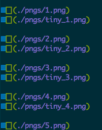

# BrowserTinyPNG

- 在浏览器内运行的PNG瘦身工具

- 仅适用于颜色不丰富的图片(如LOGO、默认头像等)

## 基本原理

- PNG具体结构请参考w3文档:[w3document](https://www.w3.org/TR/2003/REC-PNG-20031110)

- 将RGBA类型的PNG图片通过简单的聚类算法减少颜色总数,并最终转换成PLTE型,减小数据量

## 使用方式(参考demo)

- 编译打包(已包含打包后的代码)

```bash
npm install && npm run make
```

- 引入源代码:

```javascript
<script src="../dist/index.js"></script>
```

- 相关方法

```javascript
// 读取buffer,解析后绘制出来
const reader = new PNGReader(buffer);
const reader.getPainter().draw(document.body);

// 聚类算法生成调色板图片
// paletteLength 为生成调色板的size
const writer = reader.getWriter();
writer.cluster(paletteLength);

// 绘制在浏览器上
writer.getPainter().draw(document.body);

// 生成二进制Blob并通过下载
const result = document.createElement('a');
result.href = URL.createObjectURL(writer.writeAsPNG());
result.download = 'output.png';
result.click();
```

## 基本效果

- 以下为paletteLength=5的效果图





